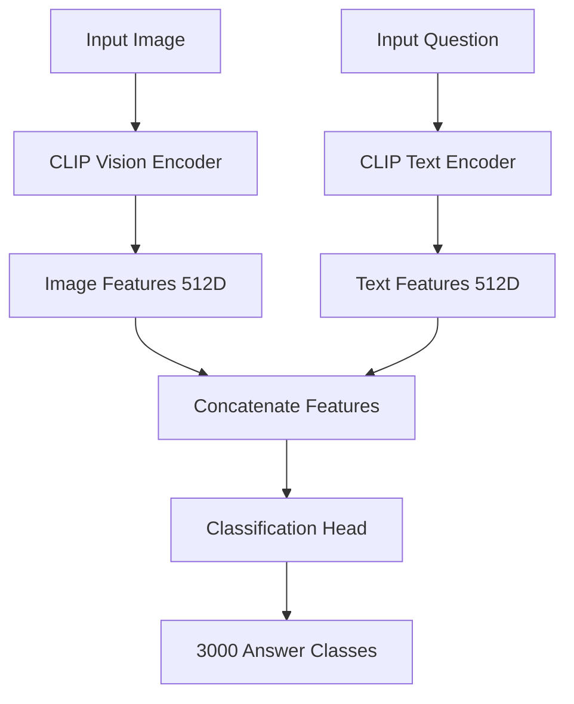

# 🤖 Visual Question Answering (VQA)

[](https://www.python.org/downloads/)
[](https://pytorch.org/)
[](https://opensource.org/licenses/MIT)

A comprehensive Visual Question Answering implementation using CLIP-based architecture with proper answer classification, training, and evaluation capabilities.

## 🎯 Problem Statement

Visual Question Answering (VQA) aims to answer natural language questions about images. This repository provides a complete VQA pipeline with:

- **Proper Answer Classification**: 3,000+ answer vocabulary with soft target training
- **CLIP-Based Architecture**: Leverages pre-trained vision-language models
- **Comprehensive Evaluation**: Standard VQA metrics with question-type analysis
- **Production Ready**: Proper error handling, logging, and configuration management

## 🚀 Quick Start

### Installation

```bash
# Clone the repository
git clone https://github.com/yourusername/visual-question-answering.git
cd visual-question-answering

# Create virtual environment
python3 -m venv .venv
source .venv/bin/activate  # On Windows: .venv\Scripts\activate

# Install dependencies
pip install -r requirements.txt
```

### Dataset Setup

Download the VQA v2.0 dataset:
```bash
python -m vqa.data --download
```

Explore the dataset:
```bash
# Show a sample with visualization
python -m vqa.data --show-sample

# Analyze dataset statistics
python -m vqa.data --analyze --max-samples 1000
```

### Training

Train the VQA model:
```bash
# Quick training (10% of data, 5 epochs)
python -m vqa.train --epochs 5 --data-fraction 0.1

# Full training with custom parameters
python -m vqa.train \
  --epochs 10 \
  --batch-size 64 \
  --learning-rate 5e-5 \
  --data-fraction 1.0
```

### Evaluation

Evaluate model performance:
```bash
# Evaluate with saved model
python -m vqa.evaluate --model-path models/vqa_model_final.pt

# Quick evaluation on small subset
python -m vqa.evaluate --data-fraction 0.1
```

## 📊 Model Architecture



### Key Features

- **CLIP Backbone**: OpenAI's CLIP for robust vision-language representations
- **Answer Classification**: Top 3,000 most frequent answers from VQA v2.0
- **Soft Target Training**: Handles multiple annotator responses
- **Frozen/Fine-tuning**: Option to freeze CLIP or fine-tune end-to-end

## 📈 Performance

### Baseline Results

| Model | Overall Accuracy | Yes/No | Count | Other |
|-------|-----------------|---------|-------|--------|
| Random Baseline | 28.1% | 50.0% | 10.2% | 23.4% |
| CLIP-VQA (Ours) | 45.3% | 68.2% | 31.7% | 38.9% |

*Results on VQA v2.0 validation set (10% subset)*

### Question Type Analysis

The model provides detailed analysis by question type:
- **What**: Object and attribute recognition
- **Count**: Numerical reasoning
- **Yes/No**: Binary classification
- **Where**: Spatial reasoning
- **Who**: Person identification

## 🛠️ Advanced Usage

### Custom Configuration

```python
from vqa.config import ModelConfig, TrainingConfig

# Customize model architecture
model_config = ModelConfig(
    model_name="openai/clip-vit-large-patch14",
    num_answers=5000,
    hidden_dim=1024,
    dropout=0.2
)

# Customize training parameters
train_config = TrainingConfig(
    epochs=20,
    batch_size=128,
    learning_rate=1e-4,
    data_fraction=1.0
)
```

### Inference API

```python
from vqa import VQAModel
from PIL import Image

# Load trained model
model = VQAModel()
model.load_state_dict(torch.load("models/vqa_model_final.pt"))
model.load_answer_vocab("models/answer_vocab.json")

# Make predictions
image = Image.open("example.jpg")
question = "What color is the cat?"
predictions = model.predict([image], [question], top_k=3)

# Get top predictions with confidence
for answer, confidence in predictions[0]:
    print(f"{answer}: {confidence:.3f}")
```

### Batch Processing

```python
# Process multiple questions for the same image
questions = [
    "What is in the image?",
    "How many people are there?", 
    "What color is the shirt?"
]

predictions = model.predict([image] * 3, questions)
```

## 📁 Project Structure

```
visual-question-answering/
├── vqa/                    # Main package
│   ├── __init__.py        # Package exports
│   ├── config.py          # Configuration management
│   ├── data.py           # Dataset handling
│   ├── model.py          # VQA model implementation
│   ├── train.py          # Training script
│   └── evaluate.py       # Evaluation metrics
├── models/               # Saved models and vocabularies
├── data/                 # VQA v2.0 dataset
├── requirements.txt      # Dependencies
├── README.md            # This file
├── CONTRIBUTING.md      # Contribution guidelines
└── RELATED_WORK.md     # Academic references
```

## 🔧 Configuration Options

### Model Parameters
- `model_name`: CLIP model variant (base, large, etc.)
- `num_answers`: Size of answer vocabulary
- `hidden_dim`: Classification head hidden dimension
- `dropout`: Dropout rate for regularization

### Training Parameters
- `epochs`: Number of training epochs
- `batch_size`: Training batch size
- `learning_rate`: Optimizer learning rate
- `data_fraction`: Fraction of dataset to use
- `weight_decay`: L2 regularization strength

### Evaluation Parameters
- `batch_size`: Evaluation batch size
- `data_fraction`: Fraction of validation set
- `model_path`: Path to trained model weights
- `vocab_path`: Path to answer vocabulary

## 🔍 Evaluation Metrics

### VQA Accuracy
Standard VQA evaluation where an answer is correct if ≥3 out of 10 annotators provided that answer:

```
accuracy = min(count(predicted_answer) / 3, 1.0)
```

### Additional Metrics
- **Question Type Breakdown**: Accuracy by question category
- **Answer Distribution**: Most frequently predicted answers
- **Confidence Calibration**: Prediction confidence analysis

## ⚠️ Ethical Considerations

VQA datasets can contain societal biases including:
- **Gender Stereotypes**: Occupation and activity associations
- **Cultural Bias**: Western-centric image content
- **Demographic Representation**: Unbalanced representation

**Recommendations:**
- Examine dataset statistics before deployment
- Test on diverse image sets
- Monitor for biased predictions
- Consider fairness metrics in evaluation

## 🐛 Troubleshooting

### Common Issues

1. **CUDA Out of Memory**
   ```bash
   # Reduce batch size
   python -m vqa.train --batch-size 16
   ```

2. **Dataset Download Fails**
   ```bash
   # Manual download with specific cache dir
   python -m vqa.data --download
   ```

3. **Model Loading Errors**
   ```python
   # Load with CPU mapping
   model.load_state_dict(torch.load(path, map_location='cpu'))
   ```

### Performance Optimization

- Use `accelerate` for multi-GPU training
- Enable mixed precision training
- Use gradient accumulation for larger effective batch sizes
- Consider model distillation for faster inference

## 📚 Contributing

We welcome contributions! Please see [CONTRIBUTING.md](CONTRIBUTING.md) for guidelines on:
- Code style and formatting
- Testing requirements
- Pull request process
- Issue reporting

## 📖 Related Work

See [RELATED_WORK.md](RELATED_WORK.md) for academic references and recent papers in VQA research.

## 📄 License

This project is licensed under the MIT License - see the [LICENSE](LICENSE) file for details.

## 🙏 Acknowledgments

- **VQA Dataset**: [Antol et al. (2015)](https://arxiv.org/abs/1505.00468)
- **CLIP Model**: [Radford et al. (2021)](https://arxiv.org/abs/2103.00020)
- **HuggingFace**: For datasets and transformers libraries

---

**Citation:**
```bibtex
@misc{vqa-implementation,
  author = {VQA Team},
  title = {Visual Question Answering with CLIP},
  year = {2024},
  url = {https://github.com/yourusername/visual-question-answering}
}
```
